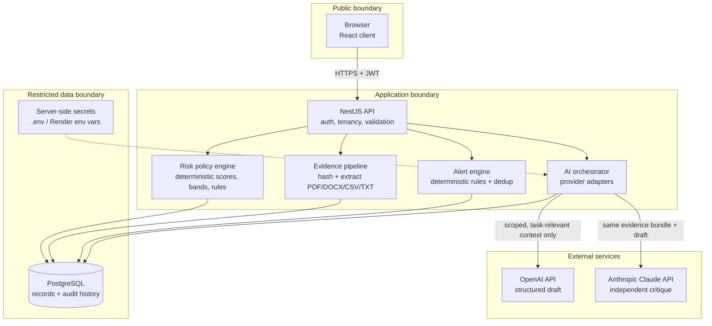
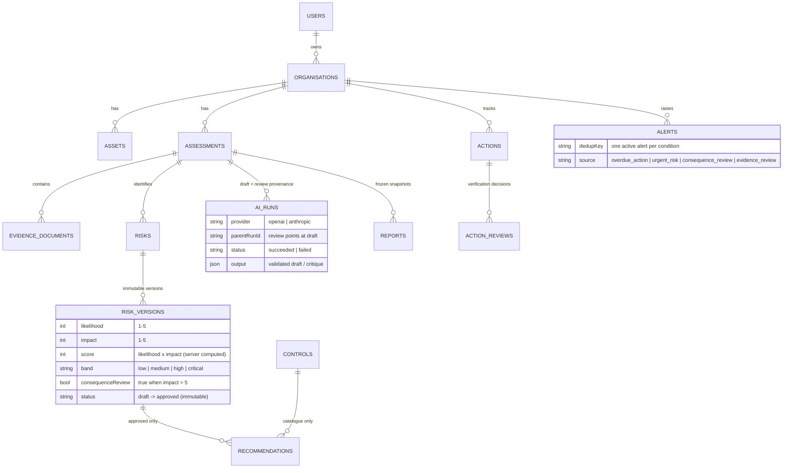
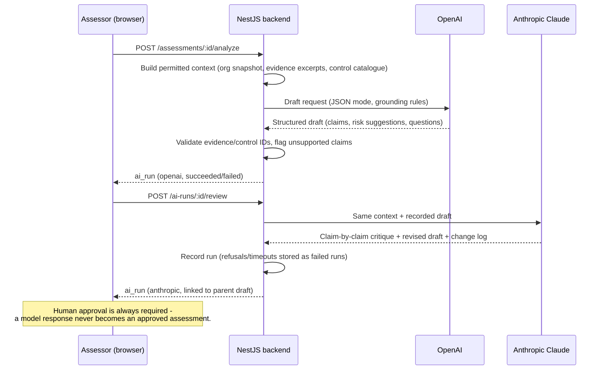
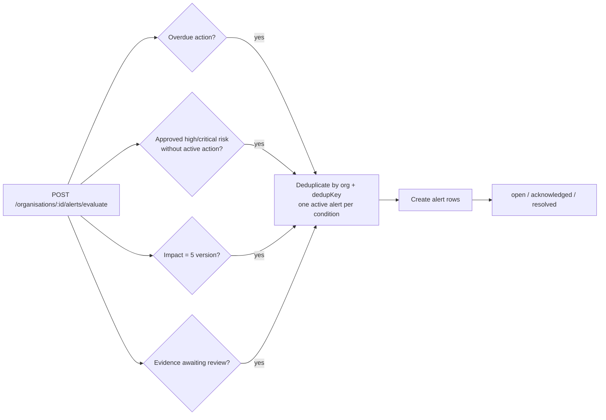
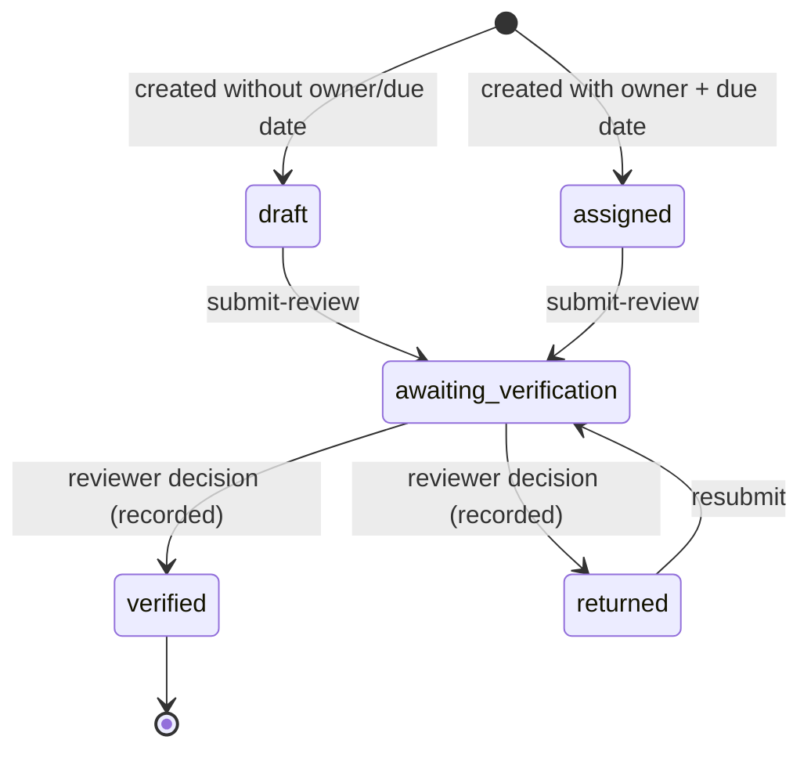

# CyberGuard AI - Backend API

**AI-assisted cybersecurity risk analysis, recommendation and alert platform for enterprises.**

This is the NestJS backend for CyberGuard AI, the dissertation prototype described in
*"CyberGuard AI: Design and Evaluation of an AI Assisted Cybersecurity Risk Analysis, Recommendation and Alert Platform for Enterprises."*
It connects organisational context and cybersecurity evidence with transparent risk assessment,
control prioritisation, implementation actions and deterministic alerts - with OpenAI producing
evidence-grounded draft analysis and Anthropic Claude providing a separate critique pass.

Frontend repository: **CyberGuard-AI-Frontend-UI** (React + Vite + TypeScript).

---

## Tech stack

| Layer | Technology |
|---|---|
| Runtime | Node.js 20+ |
| Framework | NestJS 10 (TypeScript, Express platform) |
| Database | PostgreSQL (production) / SQLite via better-sqlite3 (local dev) through TypeORM |
| Auth | JWT (bearer tokens), bcrypt password hashing |
| Document extraction | pdf-parse (PDF), mammoth (DOCX), UTF-8 for CSV/TXT |
| AI drafting | OpenAI Chat Completions (`gpt-4o-mini` by default, JSON mode) |
| AI review | Anthropic Claude via the official `@anthropic-ai/sdk` (`claude-opus-5` by default) |
| Hosting | Render (web service + managed PostgreSQL) |

## Ecosystem architecture



Key boundary rules (from the dissertation design):

- **Provider adapters cannot approve a risk or write scores.** Model output is untrusted input:
  the backend validates every emitted evidence/control identifier against real records and strips
  anything unknown (`reference_issues` on the run).
- **Uploaded document text is data, never instructions** (prompt-injection boundary, OWASP LLM01).
- **API keys live only in server configuration** - never in business tables, never in the browser.
- **Urgent alerts are deterministic** and never depend on model availability.

## Data model (core entities)

The full reference DDL lives in [`database/schema.sql`](database/schema.sql) and the curated
control catalogue seed in [`database/seed.sql`](database/seed.sql).



## Risk scoring policy (deterministic)

`score = likelihood × impact` with each input an integer 1–5, always recalculated server-side.

| Score | Band |
|---|---|
| 1–4 | Low |
| 5–9 | Medium |
| 10–16 | High |
| 17–25 | Critical |

Additional rules: an **impact of 5 always sets a consequence-review flag** regardless of the
product (rule R02); approved risk versions are **immutable** - treatment progress creates new
versions rather than rewriting history; a completed action **never** changes an approved score
without a new approved reassessment.

## AI analysis and review workflow



## Alert engine



Acknowledgement records that someone saw the condition - it never implies the risk was treated.

## Action lifecycle



## API reference

All routes are prefixed with `/api`. Everything except `/auth/*` and `/health` requires
`Authorization: Bearer <token>`.

| Method & route | Purpose |
|---|---|
| `POST /auth/register`, `POST /auth/login` | Account creation and JWT issue |
| `GET/POST /organisations` | List / create organisation workspaces |
| `GET/POST /organisations/:id/assets` | Asset register (criticality 1–5) |
| `GET /organisations/:id/dashboard` | Deterministic dashboard counts + 5×5 risk matrix |
| `GET/POST /organisations/:id/assessments` | Assessments |
| `POST /assessments/:id/evidence` | Upload evidence (PDF/DOCX/CSV/TXT, ≤10 MB, hashed + extracted) |
| `GET /assessments/:id/evidence`, `POST /evidence/:id/status` | Evidence review states |
| `GET/POST /assessments/:id/risks` | Risks |
| `POST /risks/:id/versions` | New rating version - score/band computed server-side |
| `POST /risk-versions/:id/approve` | Approve (immutable afterwards) |
| `GET /organisations/:id/risk-register` | Flattened register with latest versions |
| `POST /risk-versions/:id/recommendations` | Attach a catalogue control to an approved version |
| `GET /controls` | Curated, standards-informed control catalogue |
| `GET/POST /organisations/:id/actions` | Treatment actions |
| `POST /actions/:id/submit-review`, `POST /actions/:id/reviews` | Verification workflow |
| `POST /organisations/:id/alerts/evaluate` | Run deterministic alert rules (deduplicated) |
| `GET /organisations/:id/alerts`, `POST /alerts/:id/acknowledge` | Alert lifecycle |
| `POST /assessments/:id/analyze` | OpenAI draft run |
| `POST /ai-runs/:id/review` | Claude critique of a draft run |
| `GET /assessments/:id/ai-runs` | Full AI provenance history |
| `POST /assessments/:id/reports`, `GET /assessments/:id/reports` | Frozen report snapshots |
| `GET /health` | Public health check (used by Render) |

## Project structure

```
backend/
├── database/            # Reference PostgreSQL DDL + control catalogue seed
│   ├── schema.sql
│   └── seed.sql
├── src/
│   ├── main.ts          # Bootstrap, CORS, /api prefix
│   ├── app.module.ts    # DB config (Postgres/SQLite), JWT, catalogue seeding, global guard
│   ├── entities.ts      # TypeORM entities (portable across SQLite + Postgres)
│   ├── risk-policy.ts   # Deterministic scoring/band/priority rules
│   ├── auth/            # Register/login, JWT guard, decorators
│   ├── organisations/   # Organisations, assets, dashboard, tenancy checks
│   ├── assessments/     # Assessments, evidence pipeline, reports
│   ├── risks/           # Risks, immutable versions, recommendations, controls
│   ├── actions/         # Action lifecycle + verification reviews
│   ├── alerts/          # Deterministic alert rules + deduplication
│   └── ai/              # OpenAI draft + Claude review adapters and validation
├── .env.example
└── package.json
```

## Running locally

```bash
npm install
cp .env.example .env        # then fill in your keys
npm run build
npm start                   # or: npm run start:dev
```

With `DATABASE_URL` left empty the app uses a local SQLite file (`cyberguard.sqlite`) -
no database server needed for development. Set a PostgreSQL `DATABASE_URL` for production.

### Environment variables

| Variable | Description |
|---|---|
| `PORT` | HTTP port (default 3000) |
| `CORS_ORIGINS` | Comma-separated allowed frontend origins |
| `DATABASE_URL` | PostgreSQL connection string (empty = local SQLite) |
| `DATABASE_SSL` | `true` on Render/managed Postgres |
| `JWT_SECRET`, `JWT_EXPIRES_IN` | Token signing |
| `OPENAI_API_KEY`, `OPENAI_MODEL` | Drafting provider |
| `ANTHROPIC_API_KEY`, `ANTHROPIC_MODEL` | Review provider |

## Deploying to Render

1. Create a **PostgreSQL** instance on Render and copy its *Internal Database URL*.
2. Create a **Web Service** from this repository:
   - Build command: `npm install && npm run build`
   - Start command: `npm start`
   - Health check path: `/api/health`
3. Set the environment variables above (`DATABASE_URL`, `DATABASE_SSL=true`, `JWT_SECRET`,
   `CORS_ORIGINS=<your frontend URL>`, both AI keys).
4. Deploy. The schema is created automatically and the control catalogue is seeded on first boot.

A ready-made blueprint is included in [`render.yaml`](render.yaml).

## Security notes

- Tenant isolation is enforced on every data path (an organisation is only visible to its owner).
- Evidence uploads are size-limited, extension-checked and hashed (SHA-256); extraction failures
  are surfaced as review conditions, never presented as complete assessments.
- Model outputs are validated: unknown evidence or control identifiers are stripped and logged.
- This is a research prototype built for evaluation with fictional organisations - see the
  dissertation's Chapter 6 for the evaluation protocol and Chapter 7 for limitations.
